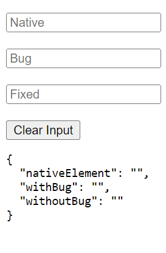

# Angular custom control retains value after reset



Took me a while to explain why this would happen, but apparently it's expected behavior.

````
@usageNotes
### Write a value to the element

The following example writes a value to the native DOM element.

ts
writeValue(value: any): void {
  this._renderer.setProperty(this._elementRef.nativeElement, 'value', value);
}
````

Found in the interface file `ControlValueAccessor`, so you can't use regular data binding in these types of components.
